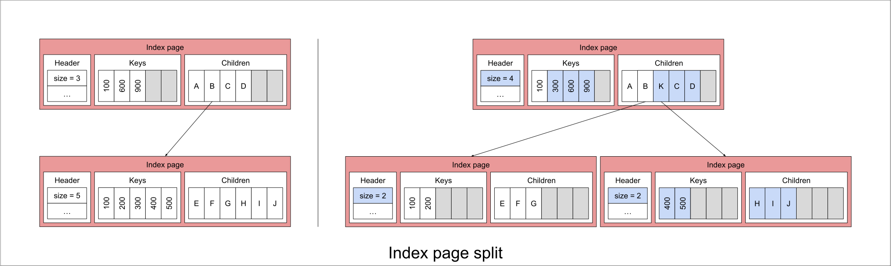
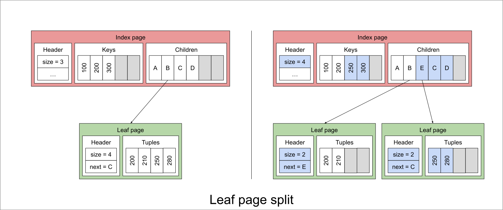

# Programming Assignment 2

In this assignment, we will implement a file with a tree index. The file will store tuples in sorted order and
the index will allow us to quickly find tuples based on an integer key.

## BTreeFile

A `BTreeFile` stores tuples in sorted order. The file is divided into index pages and leaf pages.
Index pages store keys and page numbers of other pages (index or leaf). Leaf pages store tuples.

The first page of the file is **always** the root index page. This is because we do not persist any information
regarding the structure of the file, so in case of a crash, we need to be able to read the root index page to navigate
the tree.

The root may point to zero or children pages. Each page will either be an index page or a leaf page. Index pages point
to other pages, while leaf pages store tuples.
Starting from the root, we can traverse the tree to find the appropriate leaf page for a given key.

### BTreeFile::BTreeFile

The constructor for `BTreeFile` specifies the `key_index` which is the index of the key field in the tuple.
This is and integer field that is used as a sort key for the tuples in the file.

### BTreeFile::insertTuple

The `insertTuple` method inserts a tuple into the correct leaf page of the file. If the leaf is full
after the insertion, the leaf is split into two pages.
The median key is inserted to the parent index page with the page number of the new leaf page.
This may cause the parent index page to split as well. This process may continue until the root index page is reached.
If the root is full, two new index pages are created and the contents of the root are split between them.

### BTreeFile::getTuple

The `getTuple` method returns a tuple that corresponds to the provided iterator. The tuple is deserialized from the
page.

### BTreeFile::next

The `next` method advances the iterator to the next populated tuple. This tuple may be in a subsequent leaf page. If
there
are no more tuples, the iterator is set to the end of the file.

### BTreeFile::begin

The `begin` method returns an iterator to the first populated tuple in the file. This will be in the leftmost leaf
of the file. If the file is empty, the iterator is set to the end of the file.

### BTreeFile::end

The `end` method returns an iterator to the end of the file.

## IndexPage

The `IndexPage` class represents an index page in a `BTreeFile`. It is a wrapper of the `Page` type, meaning that
it does not store any data itself, but it provides an interface to read and write to and from the page.

The layout of an index page is as follows:

- The header of the page (`IndexPageHeader`) that contains the number of keys in the page (`size`) and whether the next
  level is the leaf level or not.
- `size` keys that are sorted in ascending order.
- `size + 1` page numbers that correspond to the children pages.

The i-th child page is responsible for keys in the range `[keys[i], keys[i+1])`.

### IndexPage::insert

The `insert` method inserts a key and a page number into the index page. This entry should be inserted in the correct
position in the page. If the page is full after the insertion, return true to indicate that the page should be split.

### IndexPage::split

The `split` method splits the index page into two pages. The middle key is returned, and **it is not** kept in either
page.

The following example shows a split followed by an insert to the parent node.
The index page is split into two by moving half of the keys and children to the new page.
The returned key (300) is later inserted to the parent node.

## LeafPage

The `LeafPage` class represents a leaf page in a `BTreeFile`. It is a wrapper of the `Page` type, meaning that
it does not store any data itself, but it provides an interface to read and write to and from the page.

The layout of a leaf page is as follows:

- The header of the page (`LeafPageHeader`) that contains the number of tuples in the page (`size`) and the page number
  of the next leaf page.
- `size` tuples that are sorted in ascending order.

### LeafPage::getTuple

The `getTuple` method returns a tuple that corresponds to the provided iterator. The tuple is deserialized from the
page.

### LeafPage::insertTuple

The `insertTuple` method inserts a tuple into the correct position of the leaf page.
If the key already exists in the page, the tuple is updated with the new value.
If the leaf is full after the insertion, return true to indicate that the page should be split.

### LeafPage::split

The `split` method splits the leaf page into two pages. The key of the middle tuple is returned, and it **is** kept in
the new page.

The following example shows a split of a leaf page.

### Questions

1. Maintaining an index of a file can slow down insertions and deletions as the index needs to be updated. However, it
   can speed up lookups. What are some strategies to minimize the impact of index maintenance on bulk insertions and
   deletions? What do you need to change in the implementation to support these strategies?
2. A common workload for database tables is to insert new entries with an auto-incrementing key. How can you optimize
   the BTreeFile for this workload?
3. A common strategy employed in production systems is to maintain the internal nodes of indexes to always exist in the
   bufferpool (or rather, pin them to memory). Discuss why this is a good idea and if there are any implications of this
   strategy.

You will be submitting your answers to these questions <u>**directly on Gradescope**</u>.

### Grading

- <u>**60% of your grade**</u> will be based on whether your code passes the tests when we run it. These tests will be a
  superset
  of the tests we have provided. Before handing in your code, you should make sure your code produces no errors.

- For testing, we will use `ctest` with our version of the tests. This means you cannot change the format of binary
  files.
  You should also not change our API. You should test that your code compiles the unmodified tests. Try to add code only
  where we have indicated.

- <u>**30% of your grade**</u> will be based on your answer to the technical questions posted above. **You must follow
  instructions posted above to submit your answers.**

- <u>**10% of your grade</u>** will be based on the quality of your writeup and our subjective evaluation of your code.

We hope you enjoy hacking on this assignment!
