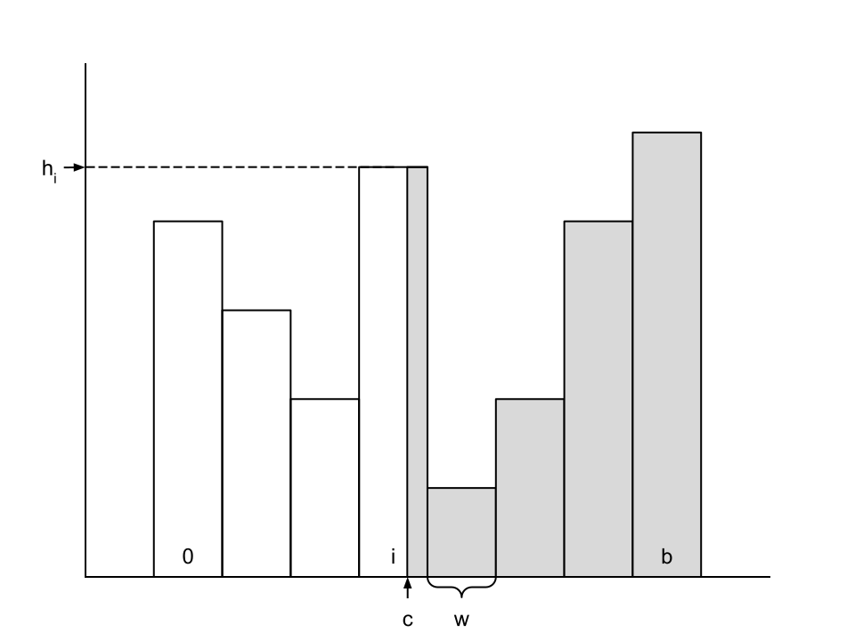

# Programming Assignment 4

We need to be able to make rough estimates of the number of tuples that will be returned by a query. This is important
for query optimization, as it allows the query planner to choose the best query plan based on the estimated cost of each
plan. In this assignment, you will implement some estimation functions for a simple query planner.

## Filter Cardinality Estimation

The class `ColumnStats` is used to store statistics about a column in a table. It is based on a histogram of the values
in the column. The histogram is an array of `buckets` integers, where each integer represents the number of values of
the column that fall into a particular range. The ranges are determined by the `min` and `max` values of the column, and
the number of buckets in the histogram. The `min` and `max` values are provided when the `ColumnStats` object is
created, and no values outside of this range will be added to the histogram.

Estimating the size of a selection predicate is a common operation in query optimization. The cardinality of a selection
predicate is the number of tuples that satisfy the predicate. We can use the histogram to make a rough estimation of the
cardinality of a selection predicate as follows:

- Construct a histogram by splitting the [min, max] domain in equally sized `buckets` of length `w`. Each bucket
  representing the number of records in a fixed range of the domain of the attribute of the histogram.
  For example, if a field `f` ranges from 1 to 100, and there are 10 buckets, then bucket 0 would contain the count of
  the number of records between 1 and 10, bucket 1 the count of the number of records between 11 and 20, and so on.
  Note: Keep count of how many elements have been added to the histogram.
- To estimate the cardinality of an equality expression, `f = c`, compute the bucket that contains value `c`.
  Suppose the width (range of values) of the bucket is `w`, the height (number of tuples) is `h`, and the number of
  tuples in the table is `n`. Then, assuming values are uniformly distributed throughout the bucket, the cardinality
  of the expression is roughly `h / w`.
- To estimate the cardinality of a range expression `f > c`, compute the bucket `i` that `c` is in, with width `w` and
  height `h`. Assuming tuples are uniformly distributed throughout bucket `i`, the fraction of the bucket that satisfies
  the predicate is `(r - c) / w`, where `r` is the right endpoint of bucket `i`. In addition, buckets `i+1 ... b`
  contribute all of their cardinality. Summing the cardinality contributions of all the buckets will yield the overall
  cardinality of the expression. The figure illustrates this process.
- Selectivity of expressions involving less than can be performed similar to the greater than case, looking at buckets
  down to 0.

## Questions

1. Given the cardinality of a selection predicate, can you estimate the IO cost of the query? What other factors would
   you need to consider to estimate the IO cost?
2. In the previous assignment we introduced a join operation. How would you estimate the cardinality of a join between
   two tables based on the histograms of the join columns?
3. A table is stored in a file that consists of 150000 pages. Assume the cardinality of a predicate is 1000, a leaf page
   can fit 50 tuples, and the table is stored in a BTreeFile with 3 levels (root -> internal -> leaf). How many pages
   would you need to read to evaluate the predicate? What if the table was stored in a HeapFile?
