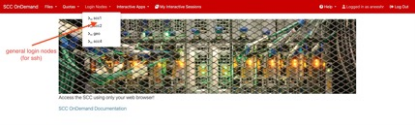
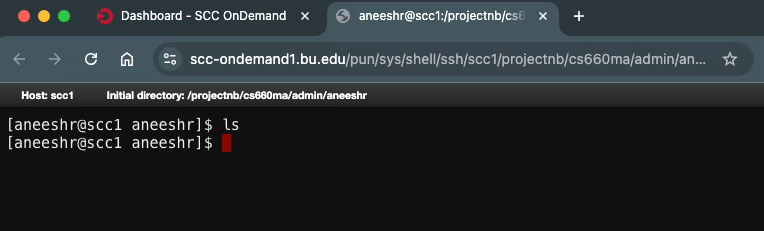
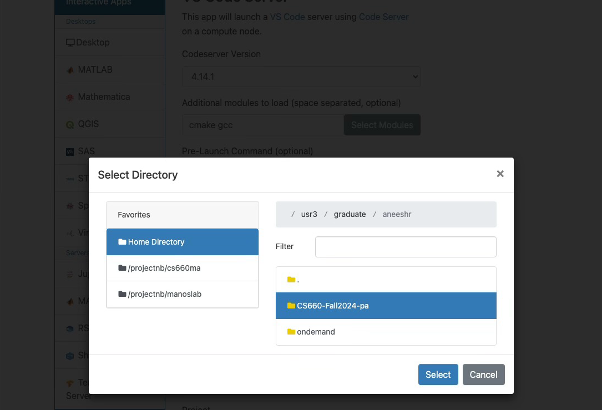

# CS660 Class Project on SCC

The Shared Computing Cluster (SCC) provides a standardized environment for the class project.
SCC can be fully accessed and used over the web browser and does not require a specific OS on your personal machine neither an SSH client.
Using SCC will simplify setting up the working environments for the CS660 project.

Below we have a guide to help you get started with SCC.
**You can read more about the SCC [here](https://www.bu.edu/tech/support/research/system-usage/connect-scc/scc-ondemand/).**

## Connecting to the SCC

Go to the following link on your web browser: [http://scc-ondemand2.bu.edu/](http://scc-ondemand2.bu.edu/).

You will be prompted to login using your BU credentials.

After logging in, you should see the following page, which is the **_scc-dashboard_**:

## Navigating the SCC Dashboard

SCC allocates every class or team a "Project", attached to some quota. In this class, you will use the project listed as `cs660ma`.

### Generic Login Nodes

SCC also provides a set of generic login nodes that can be accessed with any ssh-client. You can access these nodes by clicking on the `Login Nodes` tab on the scc-dashboard. You should use only `_scc1`.

### Interactive Applications

SCC makes available a set of interactive applications that are listed under the `Interactive Apps` tab in the scc-dashboard. From those you will be using **VS Code Server** for this project.

### Accessing files related to projects

Click on `Files` in the menubar in the scc-dashboard page and choose the project listed as : `/projectnb/cs660ma`.

## Setting up SimpleDB

### Navigate to the class directory

As mentioned above, select the designated class project under `Files` from the scc-dashboard.
Once you choose `/projectnb/cs660ma`, you should see relevant sub-folders/sub-directories related to this class. This is the **_home directory_** for this class in scc.

- Note that you may not see all the directories listed in the above folder due to permissions allcoated to different user groups. However, you should be able to see the **students** folder, where you will already find a folder created according to your BU username.
  

### Accessing your dedicated folder

You can click on the _students_ folder to open your dedicated folder.

### Cloning the git repo

You should clone your private fork of the SimpleDB repo **inside** your dedicated folder (i.e., inside the folder having your `bu_username`).

#### Opening the dedicated folder using the terminal

Once you open your dedicated folder, you should see the following page:

Click on the `_Open in Terminal` tab. You will see a list of login nodes. Choose `scc1`.
This will open a terminal session in a new browser tab/window.

#### Generating your SSH key

Github requires you to generate SSH keys and upload the public key as a verification step, if you choose to clone your git repo using `SSH` (it is recommended you do so).

Enter the following command in the terminal session:
`ssh-keygen -t ed25519 -C "<your_bu_username>@bu.edu"`.

You will be prompted for the location to save your ssh key-pairs. **Choose the default option** by simply clicking enter.

- Make sure you note the path where the key-pair is saved. You will need this to upload the public key on Github.

If you have saved the key-pair in the default location, you should be able to access it (replace `<bu_username>` with your actual username) using the following command:
`cat /usr3/graduate/<bu_username>/.ssh/id_ed25519`.

Here is a screenshot after executing the commands listed above:

**Upload** your public key to Github. Instructions to do so can be found [here](https://docs.github.com/en/authentication/connecting-to-github-with-ssh/adding-a-new-ssh-key-to-your-github-account#adding-a-new-ssh-key-to-your-account)

#### Clone the repo

You should now be ready to clone your repo. Your command should be like: `git clone git@github.com:<github_username>:<repo_name>.git`.

**Remember** to choose the ssh link for the repo.

### Accessing Visual Studio Code on SCC

SCC's interactive apps also includes VS Code server, which will allow us to continue development in the IDE directly from our browser. Further, SCC offers this as a dedicated instance with the selected configuration!

To open VS Code server on SCC, choose the `Interactive Apps` tab on the **scc-dashboard**. Click on `VS Code Server`.

#### Setting up our VS Code Instance

After the above step, you should see the following page:

##### Loading Additional Modules

SCC allows us to load additional modules into the instance. When you initially use SCC, you may see the `Additional Modules` being empty. Click on `Select Modules` and load `cmake` and `gcc` (one after the other). You only need to do this once and scc will remember your choice henceforth.

##### Setting the Working Directory

For VS Code to correctly work, it is important to set the working directory to the correct location. Click on `Select Directory` under the `Working Directory` option, which will open a pop-up window, where you can choose the appropriate directory.

**_NOTE: While you may see the cloned repo (`/usr3/graduate/<bu_username>`), DO NOT SELECT THIS LOCATION_**. Follow the instructions below.

Navigate to the project folder -> students -> dedicated folder -> cloned repo.

**_Your final working directory path should look like: `/projectnb/cs660ma/students/<bu_username>/<repo>`_**

- Note that in the above image, the path is slightly different as my dedicated folder is inside the `admin` directory. However, you should be listed under `students` directory, as mentioned earlier.

##### Selecting Number of Hours, Cores, and GPUs

Since this is not a compute-intensive project you should select 1 CPU and no GPUs. Further if you limit your session to 12 hours or less the VS Code instance will be made available immediately.
**Requesting a longer session or more CPU resources will delay you.**

- Even if your instance expires, your files are always stored in SCC. However, remember to save your code frequently, and also commit and push your work regularly to the repo, to avoid losing any work.

#### Launching the instance

Click on launch after setting up all the other options. You should see the following page:

After a few seconds/couple of minutes, the instance should be made available, after which your page would look like:

Click on `Connect to VS Code` button to **launch the instance**. This will open a new tab with an active VS Code server session.

#### Setting up VS Code Extensions

For the first time you are using scc's vs-code server, it would be a vanilla installation. You will need to explicitly install the `CMake Tools` extension from the `Extensions` tab (on the right pane shown as 4 boxes).

After you install the extension, you should see the `CMake` and `Testing` extensions automatically available in the workspace.

These buttons offer the same functionality as the `cmake` and `ctest` commands. More information on working with `CMake` extension in VS Code can be found [here](https://code.visualstudio.com/docs/cpp/CMake-linux)

- Note, you can also download the C++ extension shown in the above link to enable intellisense.

##### Accessing the Terminal from VS Code

You can also access a terminal from VS Code. To open the terminal, click on the top left (the three horizontal lines), as shown below and select `Terminal`.

Then, select `New Terminal` option to open the new terminal.

You should see a terminal open up on the bottom pane of your page.

You can now use your `cmake` and `ctest` commands like in any terminal within VS Code too!

**YOU ARE NOW READY TO START HACKING SIMPLEDB ON SCC!**
